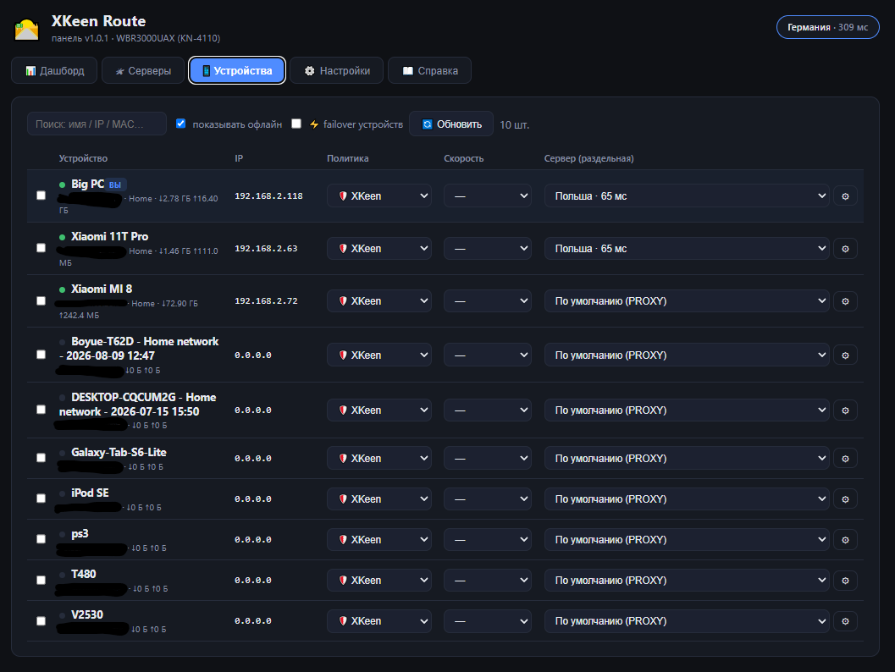
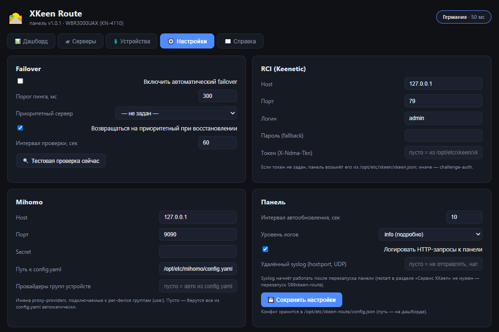
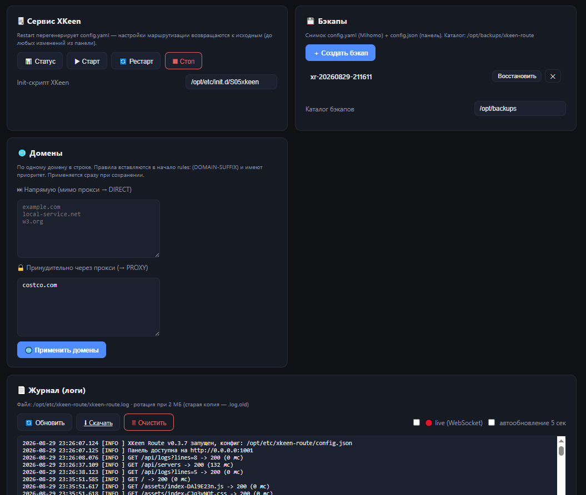
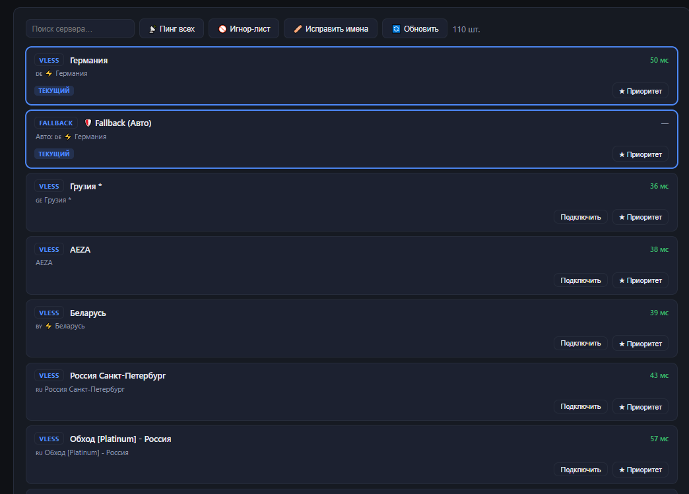

# 🛣️ XKeen Route

Веб-панель управления **раздельной маршрутизацией** для роутеров Keenetic/Netcraze с
[XKeen](https://github.com/jameszeroX/XKeen) (ядра Xray/Mihomo). Работает прямо на роутере
(Entware), интерфейс — в браузере с любого устройства локальной сети.

Порт функциональности десктопного приложения *Keenetic Policy & XKeen Manager* в веб:
форматы данных совместимы (AUTO-DEVICE-блоки в `/opt/etc/mihomo/config.yaml` — общее
хранилище правил с ПК/Android-версиями).

## ✨ Возможности

- [x] Веб-панель (тёмная тема), один бинарник без зависимостей, порт 1001
- [x] Конфиг с deep-merge (`/opt/etc/xkeen-route/config.json`)
- [x] Список серверов Mihomo: протокол, пинг, активный; переключение; приоритетный
- [x] Устройства: политика Keenetic, лимит скорости, персональный сервер Mihomo
- [x] Раздельная маршрутизация per-device (AUTO-DEVICE-блоки, без SSH, merge-семантика)
- [x] Автоматический failover (порог пинга, автовозврат на приоритетный)
- [x] Дашборд: статус роутера/Mihomo + лента событий failover
- [x] Обновление панели из UI (проверка релиза, список изменений, установка в один клик)

## 📸 Скриншоты

### 🖥 Устройства — раздельная маршрутизация per-device



Список всех устройств из DHCP роутера. Для каждого — свой сервер Mihomo
(колонка «Сервер (раздельная)»: на скриншоте Big PC и Xiaomi 11T Pro идут через
Польшу, остальные — по умолчанию через PROXY), политика Keenetic и лимит скорости.
Бейдж «ВЫ» отмечает устройство, с которого открыта панель; зелёная точка — устройство
онлайн. Поиск по имени/IP/MAC, фильтр офлайн-устройств и «⚡ failover устройств».

### ⚙️ Настройки — Failover, RCI, Mihomo, Панель



- **Failover**: автоматическое переключение на резервный сервер при превышении порога
  пинга (300 мс), приоритетный сервер и автовозврат при восстановлении, тестовая проверка.
- **RCI (Keenetic)**: доступ к API роутера; токен берётся из `/opt/etc/xkeen/xkeen.json`,
  иначе — challenge-auth по паролю.
- **Mihomo**: host/port/secret и путь к config.yaml; провайдеры для групп устройств
  определяются автоматически.
- **Панель**: интервал автообновления, уровень логов, отправка в удалённый syslog.

### 🧰 Сервис, Домены, Бэкапы, Журнал



Управление сервисом XKeen (статус/старт/рестарт/стоп), бэкапы config.yaml + config.json
с восстановлением в один клик, доменные списки (мимо прокси → DIRECT, принудительно →
PROXY — применяются сразу при сохранении) и журнал: live-стрим по WebSocket, скачивание,
очистка, ротация при 2 МБ.

### 🌐 Серверы — пинг, переключение, приоритет



Все серверы из подключённых провайдеров (на скриншоте — 110 шт.) с пингом и страной.
Текущий сервер и Fallback (Авто) помечены «ТЕКУЩИЙ»; подключение и назначение
приоритетным для failover — в один клик. Игнор-лист скрывает мусорные серверы из
автовыбора, «Исправить имена» чинит mojibake-имена в config.yaml.

## ⚡ Установка (Entware)

Стабильная/Latest версия:

```sh
curl -Ls https://raw.githubusercontent.com/nickitafedorov2012-code/xkeen-ui-ext/main/setup.sh | sh
```

Бета:

```sh
curl -Ls https://raw.githubusercontent.com/nickitafedorov2012-code/xkeen-ui-ext/main/setup.sh | sh -s -- beta
```

Удаление (конфиги сохраняются):

```sh
curl -Ls https://raw.githubusercontent.com/nickitafedorov2012-code/xkeen-ui-ext/main/setup.sh | sh -s -- uninstall
```

Удаление полностью (вместе с конфигами):

```sh
curl -Ls https://raw.githubusercontent.com/nickitafedorov2012-code/xkeen-ui-ext/main/setup.sh | sh -s -- uninstall purge
```

При запуске с терминала (SSH) скрипт показывает меню: установить/обновить, удалить или удалить полностью.

> **Если raw.githubusercontent.com недоступен** (блокировки на некоторых сетях) — используйте зеркало:
>
> ```sh
> curl -Ls https://ghproxy.net/https://raw.githubusercontent.com/nickitafedorov2012-code/xkeen-ui-ext/main/setup.sh | sh
> ```

Порт по умолчанию: **1001**. Управление сервисом:

```sh
sh /opt/etc/init.d/S99xkeen-route start|stop|restart|status
```

## 🔧 Сборка из исходников

Фронтенд (Node.js 18+):

```sh
cd frontend && npm install && npm run build
```

Бэкенд (Rust 1.75+; для целевых устройств — musl):

```sh
cd backend && cargo build --release        # dev-сборка под текущую ОС
```

Кросс-сборка под роутер — через [cross](https://github.com/cross-rs/cross) или
GitHub Actions (workflow `build.yml`: mips / mipsel / arm64 musl).

### Локальная разработка

```sh
# терминал 1: бэкенд (порт 1001)
cd backend && cargo run
# терминал 2: фронтенд с hot-reload (прокси /api -> :1001)
cd frontend && npm run dev
```

## ⚙️ Конфигурация

`/opt/etc/xkeen-route/config.json` (может быть частичным, остальное — из дефолтов):

```json
{
  "rci":     { "host": "127.0.0.1", "port": 79, "login": "admin", "password": "", "token": "" },
  "mihomo":  { "host": "127.0.0.1", "port": 9090, "secret": "" },
  "failover": { "enabled": false, "ping_threshold_ms": 300, "priority_server": "",
                "auto_restore_priority": true, "interval_secs": 60 },
  "refresh_interval_sec": 10
}
```

RCI-доступ: приоритет у `token` (`X-Ndma-Tkn`; панель подхватывает токен из
`/opt/etc/xkeen/xkeen.json`, как XKeen-UI), иначе — challenge-auth по login/password.

## ⚠️ Безопасность

Панель **не имеет авторизации** (решение осознанное) и предназначена **только для
локальной сети**. Не открывайте порт наружу без VPN/KeenDNS с паролем.

## 🙏 Благодарности

- [zxc-rv/XKeen-UI](https://github.com/zxc-rv/XKeen-UI) — источник архитектурных идей
- [Skrill0/XKeen](https://github.com/Skrill0/XKeen), [jameszeroX/XKeen](https://github.com/jameszeroX/XKeen)
- [Anonym-tsk/nfqws-keenetic](https://github.com/Anonym-tsk/nfqws-keenetic)


## 📖 Документация для разработчиков

Внутренняя документация — выстраданные грабли Mihomo/YAML/кодировок, полный ченжлог,
заметки об окружении и деплое — вынесена в [DEVELOPMENT.md](DEVELOPMENT.md).

## 📄 Лицензия

Проект распространяется под лицензией **GNU AGPL-3.0** — см. файл [LICENSE](LICENSE).

Copyright (C) 2026 nickitafedorov2012-code

