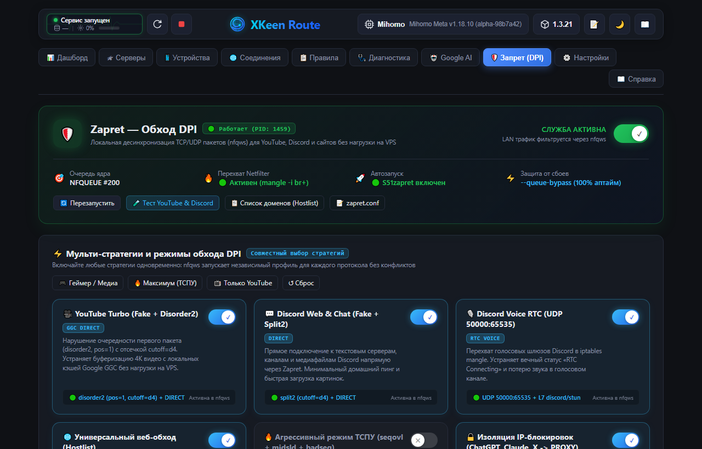
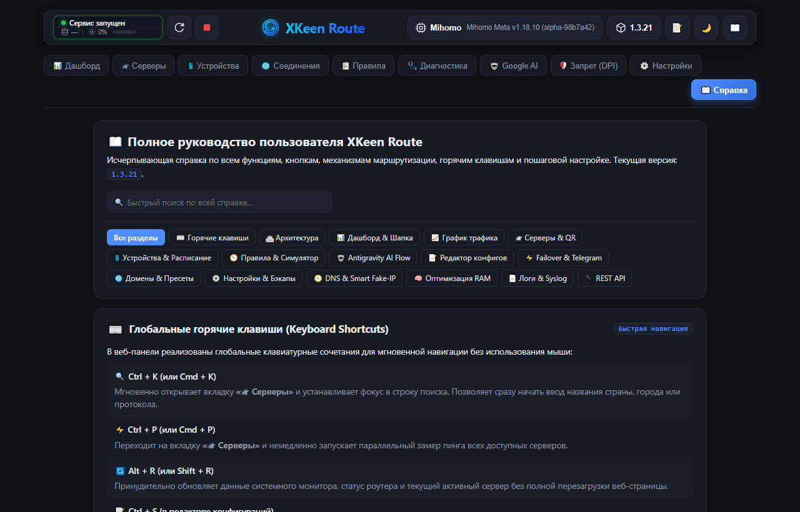

<div align="center">

# 🛣️ XKeen Route

**Высокопроизводительная веб-панель раздельной маршрутизации, обхода DPI (Zapret nfqws) и управления прокси для роутеров Keenetic / Netcraze с XKeen (Mihomo / Xray).**

[](https://github.com/nickitafedorov2012-code/xkeen-ui-ext/releases)
[](LICENSE)
[-success.svg)](https://entware.net/)
[](https://keenetic.ru/)
[-DEA584?logo=rust)](backend/)
[](frontend/)

[✨ Возможности](#-возможности) • [📸 Обзор функций и интерфейса](#-обзор-функций-и-интерфейса) • [⌨️ Горячие клавиши](#️-горячие-клавиши) • [⚡ Быстрая установка](#-быстрая-установка-entware) • [⚙️ Конфигурация](#️-конфигурация) • [🔧 Сборка](#-сборка-из-исходников)

</div>

---

## 📖 О проекте

**XKeen Route** — это современная панель управления для роутеров Keenetic и Netcraze с установленным пакетом [XKeen](https://github.com/jameszeroX/XKeen).

Она работает автономно прямо на роутере в среде **Entware** в виде единого бинарного файла, скомпилированного на Rust. Веб-сервер на базе Axum 0.7 и Tokio потребляет всего ~6–12 МБ оперативной памяти и практически нулевое количество CPU, отдавая встроенный React SPA веб-интерфейс в любом браузере на порту `1001`.

### 🌟 Ключевые архитектурные преимущества:
1. **Двухуровневая маршрутизация (Mihomo + iptables/ipset)**: автоматическое преодоление блокировок ТСПУ и российских IP (`geo_override`), параллельный CDN-сканер статики и фоновая синхронизация поддоменов.
2. **Аппаратный Zapret (nfqws)**: гибкое управление десинхронизацией пакетов прямо из интерфейса (YouTube 4K на скорости провайдера с кэшей Google GGC без расхода трафика VPS, звонки в Discord без задержек и универсальный обход блокировок сайтов).
3. **Автономность и самовосстановление (Watchdog)**: неблокирующий фоновый сторожевой процесс каждые 4 секунды контролирует целостность правил `config.yaml`. Даже при ночном перезапуске или автогенерации XKeen все пользовательские правила восстанавливаются мгновенно и бесшовно.
4. **Per-Device Policy Routing**: индивидуальное распределение клиентов домашней сети (DHCP) по персональным нодам или прямому выходу (`DIRECT`), полностью совместимое с `AUTO-DEVICE` блоками мобильных и десктопных клиентов.

---

## ✨ Возможности

- 🎨 **Современный Cyberpunk/Glassmorphism UI**: адаптивный темный и светлый режимы (WCAG AA), живые SVG-кардиограммы трафика, плавная неоновая анимация и быстрый отклик.
- 📊 **Глубокая телеметрия**: раздельный график трафика Direct vs Proxy, мониторинг системных ресурсов роутера (CPU/RAM) и суммарный учет памяти стека XKeen (панель + ядро Mihomo).
- 📱 **Раздельная маршрутизация per-device**: назначение индивидуального сервера Mihomo или прямого выхода для каждого смартфона, ПК, ТВ или игровой консоли с автоматическим маркером «ВЫ».
- 🛡️ **Интеграция Zapret DPI**: независимые тумблеры стратегий nfqws (YouTube Turbo, Discord Voice UDP, Hostlist, Aggressive DPI), готовые пресеты в 1 клик и встроенный тест обхода.
- ⚡ **Многоуровневый Failover**: мониторинг доступности нод в реальном времени, автоматическое переключение по цепочке приоритетов при сбоях и гистерезисный автовозврат на основной узел.
- 🤖 **Google AI, Flow & Antigravity**: оптимизация Anycast-маршрутов для Gemini, AI Studio, Vertex AI, генератора видео Google Flow и встроенный локальный HTTP CONNECT прокси.
- 🌐 **Монитор соединений**: детальный инспектор активных сокетов с Fake-IP декодированием хостов, скоростями, объемами данных и кнопкой сброса keep-alive сессий.
- 📋 **Инспектор правил и симулятор**: визуализация дерева маршрутизации Mihomo и моментальный симулятор маршрута для любого домена или IP локального клиента.
- 🩺 **Аудит здоровья системы**: комплексное тестирование DoH, Fake-IP, RCI KeeneticOS, свободного места Entware и утилита диагностики «Почему не открывается сайт?».
- 📦 **Управление подписками**: поддержка протоколов VLESS Reality, Shadowsocks, Hysteria2, Trojan, TUIC, WireGuard, псевдонимы провайдеров, привязка HWID и шеринг нод через QR-коды.
- 💾 **Встроенный редактор и бэкапы**: редактирование `config.yaml` и `config.json` прямо в браузере, создание резервных копий и обновление панели в один клик.

---

## 📸 Обзор функций и интерфейса

### 📊 1. Дашборд — телеметрия, графики и Failover-контроль

Центральный пункт управления и мониторинга состояния домашней сети и роутера:
- **Живой график пропускной способности**: раздельное отображение прямого трафика провайдера (`Direct`) и трафика через прокси (`Proxy`) с выбором режима (Загрузка / Отдача / Сумма).
- **Метрики оборудования**: загрузка процессора роутера, общая занятая оперативная память и детализированный расход стека XKeen (веб-панель + ядро Mihomo).
- **Hero-карточка активного сервера**: протокол подключения (VLESS Reality, Shadowsocks и др.), название подписки, текущий пинг с цветной градацией и Sparkline-график стабильности отклика.
- **Интерактивный Failover**: статус фонового мониторинга, текущая позиция в цепочке серверов (ОСН / РЕЗn), порог пинга и журнал событий переключения с умной группировкой повторов (`×N`).


---

### 🛰 2. Серверы и подписки — замер задержки, фильтры и шеринг

Полный каталог доступных прокси-нод из всех подключенных источников:
- **Широкая поддержка протоколов**: VLESS Reality, VMess, Shadowsocks, Trojan, Hysteria2, TUIC, WireGuard.
- **Интерактивный замер задержки**: параллельный опрос всех серверов (`Ctrl + P`) или отдельной ноды в один клик.
- **Управление приоритетами**: закрепление активного узла, назначение приоритетного сервера (`★ В приоритете`) для системы отказоустойчивости.
- **Фильтрация и поиск**: мгновенный поиск по названию или стране (`Ctrl + K`), выпадающий список фильтрации по подпискам и быстрый фильтр совместимости с Google AI (`Только Flow`).
- **Инструменты узлов**: генерация QR-кода и ссылок для мобильных клиентов (`vless://`, `ss://`), Outbound Generator, списки игнорирования и замер скорости Speedtest.
- **Подписки и HWID**: присвоение пользовательских названий (псевдонимов) провайдерам, принудительное обновление и поддержка защищенных подписок с привязкой HWID роутера.


---

### 📱 3. Устройства — раздельная маршрутизация per-device

Индивидуальное управление трафиком каждого клиента домашней сети на основе данных DHCP KeeneticOS:
- **Таблица клиентов**: имя устройства, IP-адрес, MAC-адрес, тип подключения (Wi-Fi 5GHz / 2.4GHz / Home Ethernet) и бейдж активного устройства пользователя («you» / «ВЫ»).
- **Раздельная маршрутизация**: назначение индивидуального сервера Mihomo (`AUTO-DEVICE-IP`) или прямого выхода (`DIRECT`) персонально для каждого клиента сети.
- **Цепочки резервирования устройств**: модальное окно персонального Failover с назначением основного и резервных серверов, персонального порога пинга и автовозврата.
- **Контроль трафика**: отображение объема скачанных/переданных данных по каждому устройству и установка лимитов скорости через Keenetic RCI API.
- **Расписание доступа**: задание временных окон активности правил маршрутизации.
- **Организация списка**: поиск по устройствам, фильтры Online / Offline, сворачиваемый аккордеон отключенных устройств и плавающая панель массовых действий.


---

### 🌐 4. Активные соединения — живой монитор сокетов

Инспектор сетевых сессий ядра Mihomo в реальном времени:
- **Полная прозрачность трафика**: мониторинг открытых TCP/UDP сокетов клиентов локальной сети.
- **Детализация сессий**: целевой домен (с разрешением Fake-IP), IP-адрес клиента и удаленного сервера, целевой порт, протокол передачи.
- **Маршрутная цепочка**: отображение сервера, через который идет соединение, и сработавшего правила маршрутизации (`DOMAIN-SUFFIX`, `IP-CIDR`, `GEOIP` и др.).
- **Скорость и объем**: текущая скорость передачи данных в реальном времени и суммарный объем скачанной/отданной информации.
- **Управление сессиями**: моментальный поиск по IP или хосту, принудительный разрыв отдельного соединения или кнопка «Закрыть все» для сброса устаревших keep-alive соединений браузеров.


---

### 📋 5. Инспектор правил и интерактивный симулятор маршрутов

Наглядный просмотр дерева маршрутизации Mihomo и диагностика путей прохождения трафика:
- **Интерактивный симулятор («Куда пойдет трафик?»)**: введите любой домен или IP-адрес (и опционально IP домашнего устройства), чтобы мгновенно увидеть пошаговую цепочку: `Клиент → Сработавшее правило → Группа селектора → Выходной сервер`.
- **Дерево правил**: структурированный каталог всех активных правил из `config.yaml` с цветовой маркировкой типов (`DOMAIN-SUFFIX`, `GEOIP`, `GEOSITE`, `IP-CIDR`, `SRC-IP-CIDR`, `MATCH`).
- **Быстрый фильтр**: группировка по типу правила и поиск по целевым шаблонам или группам назначения.


---

### 🩺 6. Диагностика и аудит здоровья системы

Комплексный инструмент тестирования сетевых компонентов и выявления проблем:
- **Мониторинг служб**: автоматическая проверка статуса и задержки отклика Keenetic RCI API, ядра Mihomo, Smart DNS / Fake-IP, таймера Failover, свободного места в Entware и ОЗУ роутера.
- **Интеллектуальный DNS-тест («Почему не открывается сайт?»)**: глубокий анализ любого домена — проверка резолва DNS, выявление подмены IP провайдером (РКН-заглушки), раздельное тестирование TCP/TLS подключения напрямую и через прокси с выдачей рекомендаций.
- **Карта политик Keenetic**: визуализация привязки сетевых интерфейсов и сегментов сети.


---

### 🤖 7. Google AI, Flow & Antigravity Bypass

Специализированная среда для комфортной работы с сервисами искусственного интеллекта:
- **Google Anycast & Geo Clean Check**: тестирование чистоты IP-адреса активного узла, проверка распознавания региона со стороны Google (US/CA) и гарантия отсутствия блокировок `unsupported-country`.
- **Google Flow Unlocker**: встроенная интеграция с движком разблокировки интерфейсов генерации видео Google Flow и Gemini Labs.
- **Google Antigravity & Cloud Code**: прозрачный обход географических ограничений API Google Cloud Code на уровне маршрутизатора без необходимости настройки клиентских ПК.
- **Локальный HTTP CONNECT прокси**: легковесный прокси-сервер на порту `53129` (с изоляцией от WAN) для CLI-утилит и агентов разработки (`AG_LS_PROXY`).
- **Пул антиблокировочных DNS**: верификация DoH/DoT резолверов и автоматическая подмена маршрутов.


---

### 🛡️ 8. Запрет (DPI) — аппаратный обход замедлений (nfqws)

Встроенный центр управления службой десинхронизации пакетов `nfqws` без нагрузки на зарубежные VPS:
- **Интеграция с Netfilter**: безопасный перехват локального клиентского трафика в цепочке `iptables mangle PREROUTING` (`-i br+`) с аппаратным флагом `--queue-bypass` (нулевой риск потери интернета при рестарте службы). Не затрагивает системный трафик роутера и облачные API.
- **Независимые тумблеры мульти-стратегий**:
  * 🎥 **YouTube Turbo (Fake + Disorder2)**: обход замедления YouTube на полной скорости домашнего провайдера напрямую с кэширующих серверов Google GGC без расхода трафика VPS.
  * 💬 **Discord Web & Chat (Fake + Split2)**: моментальная загрузка чатов, вложений и медиафайлов.
  * 🎙️ **Discord Voice RTC (UDP 50000:65535)**: перехват голосовых диапазонов RTC, устраняющий зависание статуса «RTC Connecting».
  * 🌐 **Универсальный веб-обход (Hostlist)**: разблокировка ресурсов из списка `zapret-hosts.txt` (RuTracker, NTC Party, Flibusta, Kinozal, Notion и др.).
  * 🔥 **Агрессивный режим ТСПУ (seqovl + badseq)**: пробитие глубоких блокировок операторов.
  * 🔒 **Изоляция IP-блокировок**: четкое разделение — сервисы с жесткой блокировкой по IP (ChatGPT, Claude, Instagram, X/Twitter) гарантированно направляются через туннель VPS.
- **Готовые пресеты**: «Геймер / Медиа», «Максимум (ТСПУ)», «Только YouTube» и безопасный сброс к исходным.
- **Встроенное тестирование**: моментальный замер прямого отклика YouTube и Discord с роутера.
- **Редакторы файлов**: редактирование `zapret.conf` и `zapret-hosts.txt` прямо из окна вкладки.



---

### ⚙️ 9. Настройки и автоматизация системы

Управление системными модулями, автоматизацией и безопасностью:
- **Тонкая настройка Failover**: задание порога пинга, интервала опроса, цепочки приоритетных нод и гистерезиса автовозврата.
- **DNS-режимы ядра**: выбор между `Fake-IP` (минимальная задержка ~1 мс, обход DPI) и `Redir-Host`.
- **Сторожевой таймер ядра (Watchdog)**: активная защита конфигурации каждые 4 секунды от затирания сторонними скриптами.
- **Управление доменными списками**: списки прямого доступа (`DIRECT`) и принудительного проксирования (`PROXY`) с автоматическим обнаружением скрытых CDN-поддоменов и синхронизацией с ipset `geo_override`.
- **Резервные копии (Backups)**: создание архивов конфигураций в 1 клик, выгрузка на ПК, восстановление и удаление.
- **Редактор конфигураций (Web-Editor)**: встроенный веб-редактор с валидацией синтаксиса для `config.yaml` (Mihomo) и `config.json` (панель).
- **Менеджер ядра Mihomo**: проверка доступных релизов ядра, просмотр установленной версии и бесшовное обновление бинарника.
- **Telegram-уведомления**: оповещения в личный чат Telegram при автоматических переключениях Failover или перезагрузке роутера.


---

### 📖 10. Встроенная интерактивная справка

Исчерпывающее руководство пользователя прямо в веб-интерфейсе панели:
- **Мгновенный поиск**: строка полнотекстового поиска по всем разделам документации.
- **Навигационные разделы**: Архитектура, Дашборд, Серверы, Устройства, Failover, Домены и CDN, Настройки и бэкапы, Логи и Syslog, REST API.
- **Горячие клавиши**: полный перечень сочетаний клавиш для быстрой работы без мыши.
- **Готовые сниппеты**: примеры команд curl, конфигурации crontab и системные пути Entware.



---

## ⌨️ Горячие клавиши

Веб-панель поддерживает глобальные клавиатурные комбинации для быстрой навигации:

| Сочетание клавиш | Действие |
| :--- | :--- |
| **`Ctrl + K`** (или `Cmd + K`) | Открыть вкладку **Серверы** и сфокусироваться на строке поиска |
| **`Ctrl + P`** (или `Cmd + P`) | Запустить **параллельный замер пинга** всех доступных серверов |
| **`Alt + R`** (или `Shift + R`) | Принудительно **обновить данные** телеметрии и статус системы |
| **`Ctrl + S`** *(в редакторе конфигов)* | Проверить синтаксис и **сохранить файл** с hot-reload ядра |
| **`Ctrl + F`** *(в редакторе конфигов)* | Открыть панель **поиска и замены** по тексту файла |

---

## ⚡ Быстрая установка (Entware)

Установка выполняется одной командой по SSH на роутере Keenetic/Netcraze с установленным Entware:

### Стабильная версия (Latest):

```sh
curl -Ls https://raw.githubusercontent.com/nickitafedorov2012-code/xkeen-ui-ext/main/setup.sh | sh
```

### Бета-версия (Beta):

```sh
curl -Ls https://raw.githubusercontent.com/nickitafedorov2012-code/xkeen-ui-ext/main/setup.sh | sh -s -- beta
```

> [!TIP]
> **Если `raw.githubusercontent.com` недоступен или заблокирован провайдером**, используйте зеркало:
> ```sh
> curl -Ls https://ghproxy.net/https://raw.githubusercontent.com/nickitafedorov2012-code/xkeen-ui-ext/main/setup.sh | sh
> ```

При запуске через терминал SSH скрипт откроет интерактивное меню (установка, обновление, удаление).

---

### 🕹 Управление сервисом

После установки панель доступна в браузере по адресу: **`http://<IP-роутера>:1001`** (например, `http://192.168.1.1:1001`).

Управление через системный init-скрипт Entware:
```sh
sh /opt/etc/init.d/S99xkeen-route start    # Запустить панель
sh /opt/etc/init.d/S99xkeen-route stop     # Остановить панель
sh /opt/etc/init.d/S99xkeen-route restart  # Перезапустить панель
sh /opt/etc/init.d/S99xkeen-route status   # Проверить статус процесса
```

---

### 🗑 Удаление

- **Удаление бинарника и службы (конфигурация сохраняется):**
  ```sh
  curl -Ls https://raw.githubusercontent.com/nickitafedorov2012-code/xkeen-ui-ext/main/setup.sh | sh -s -- uninstall
  ```
- **Полное удаление (вместе со всеми файлами конфигураций):**
  ```sh
  curl -Ls https://raw.githubusercontent.com/nickitafedorov2012-code/xkeen-ui-ext/main/setup.sh | sh -s -- uninstall purge
  ```

---

## ⚙️ Конфигурация

Файл конфигурации расположен по пути `/opt/etc/xkeen-route/config.json`. Поддерживается автоматический deep-merge (неуказанные параметры берутся из безопасных значений по умолчанию):

```json
{
  "rci": {
    "host": "127.0.0.1",
    "port": 79,
    "login": "admin",
    "password": "",
    "token": ""
  },
  "mihomo": {
    "host": "127.0.0.1",
    "port": 9090,
    "secret": "",
    "config_path": "/opt/etc/mihomo/config.yaml"
  },
  "failover": {
    "enabled": true,
    "ping_threshold_ms": 250,
    "priority_server": "de_vless",
    "priority_chain": [
      "de_vless",
      "nl_vless",
      "fi_trojan"
    ],
    "auto_restore_priority": true,
    "interval_secs": 45,
    "device_failover_enabled": true
  },
  "zapret": {
    "enabled": true,
    "hybrid_youtube": true,
    "hybrid_discord": true,
    "discord_voice_udp": true,
    "youtube_turbo": true,
    "general_bypass": true,
    "aggressive_dpi": false,
    "isolated_proxy": true
  },
  "refresh_interval_sec": 5,
  "adblock_enabled": true
}
```

> [!NOTE]
> **Авторизация в Keenetic RCI**: панель автоматически считывает токен `X-Ndma-Tkn` из `/opt/etc/xkeen/xkeen.json`. При отсутствии токена используется встроенная challenge-response авторизация по логину и паролю администратора.

---

## 🔧 Сборка из исходников

### 1. Сборка фронтенда (Node.js 18+):
```sh
cd frontend
npm install
npm run build
```

### 2. Сборка бэкенда (Rust 1.75+):
```sh
cd backend
cargo build --release
```

### 3. Локальная разработка (с Hot-Reload):
```sh
# Терминал 1: Запуск бэкенда на порту 1001
cd backend && cargo run

# Терминал 2: Запуск дев-сервера Vite с автоматическим проксированием /api -> :1001
cd frontend && npm run dev
```

### 4. Кросс-компиляция под роутеры (MIPS / MIPSle / ARM64):
Автоматически выполняется через [GitHub Actions](.github/workflows/build.yml) или локально с помощью [`cross`](https://github.com/cross-rs/cross):
```sh
cross build --target mipsel-unknown-linux-musl --release
cross build --target mips-unknown-linux-musl --release
cross build --target aarch64-unknown-linux-musl --release
cross build --target armv7-unknown-linux-musleabihf --release
```

---

## ⚠️ Безопасность

Панель **не требует обязательного пароля при входе из локальной сети** (осознанное решение для мгновенного доступа домашних устройств без лишних экранов ввода) и предназначена **исключительно для доверенной локальной сети (LAN)**.

> [!CAUTION]
> **Никогда не пробрасывайте порт `1001` в публичный интернет напрямую (через DMZ или NAT).**
> Для удаленного доступа извне используйте безопасные VPN-серверы роутера (WireGuard, OpenVPN, IPsec) либо службу KeenDNS с обязательной авторизацией по паролю KeeneticOS.

---

## 🤝 Совместимость и благодарности

Проект развивается в тесной интеграции с экосистемой XKeen:
- [zxc-rv/XKeen-UI](https://github.com/zxc-rv/XKeen-UI) — базовые архитектурные идеи
- [Skrill0/XKeen](https://github.com/Skrill0/XKeen) и [jameszeroX/XKeen](https://github.com/jameszeroX/XKeen) — пакет XKeen для роутеров Keenetic
- [bol-van/zapret](https://github.com/bol-van/zapret) — технология автономного обхода DPI (nfqws)
- [Anonym-tsk/nfqws-keenetic](https://github.com/Anonym-tsk/nfqws-keenetic) — наработки запуска и интеграции nfqws в KeeneticOS

---

## 📖 Документация разработчика

Детальное описание архитектурных решений, базы выстраданных грабель (Mihomo, YAML, кодировки cp1251/cp866/UTF-8, разыменование смарт-поинтеров Axum 0.7) и полный ченжлог версий доступны в [DEVELOPMENT.md](DEVELOPMENT.md).

---

## 📄 Лицензия

Проект распространяется под свободной лицензией **GNU Affero General Public License v3.0 (AGPL-3.0)**. См. файл [LICENSE](LICENSE) для подробностей.

Copyright (C) 2026 nickitafedorov2012-code

