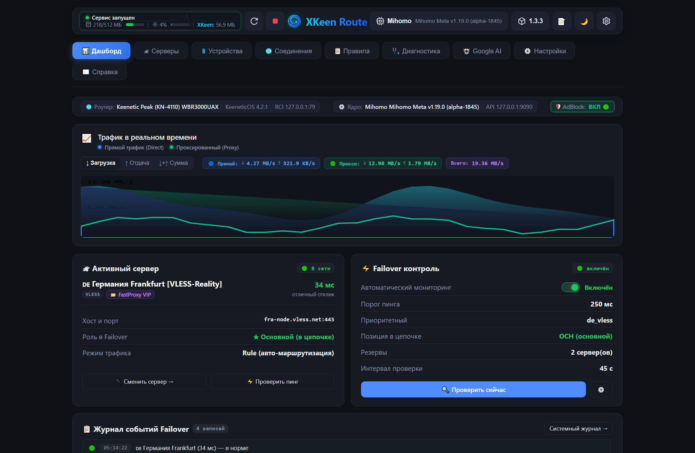
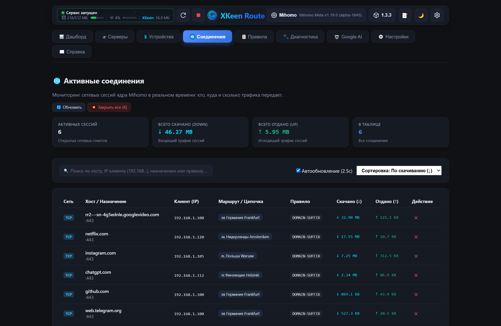
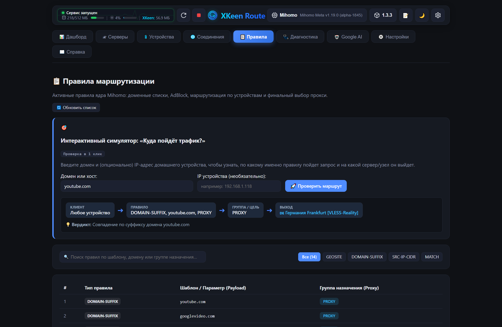
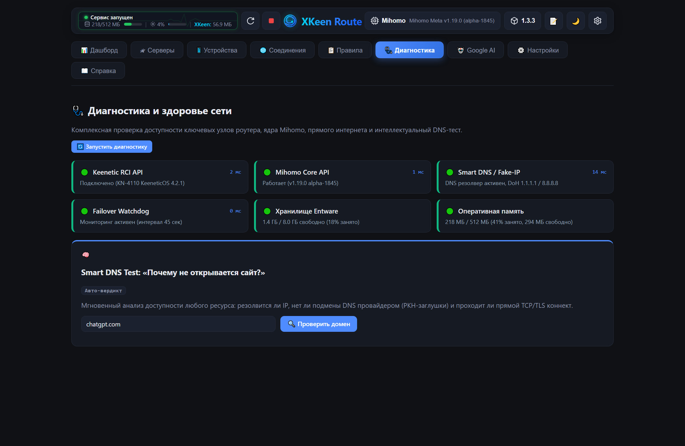
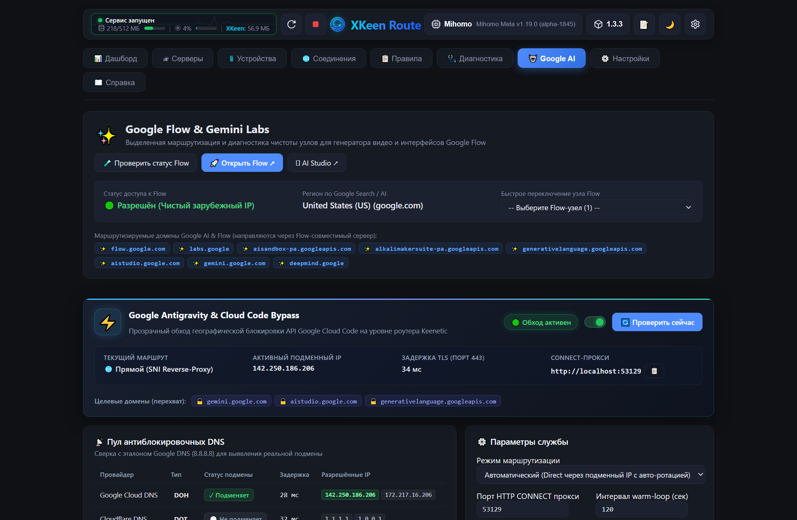

# 🛣️ XKeen Route

Веб-панель управления **раздельной маршрутизацией** для роутеров Keenetic/Netcraze с
[XKeen](https://github.com/jameszeroX/XKeen) (ядра Xray/Mihomo). Работает прямо на роутере
(Entware), интерфейс — в браузере с любого устройства локальной сети.

Порт функциональности десктопного приложения *Keenetic Policy & XKeen Manager* в веб:
форматы данных совместимы (AUTO-DEVICE-блоки в `/opt/etc/mihomo/config.yaml` — общее
хранилище правил с ПК/Android-версиями).

## ✨ Возможности

- [x] 🎨 **Современная веб-панель**: тёмная тема, адаптивный UI, один легковесный бинарник без внешних зависимостей (порт 1001)
- [x] 📱 **Раздельная маршрутизация per-device**: персональный сервер Mihomo или прямой выход (DIRECT) для каждого устройства в сети (AUTO-DEVICE блоки)
- [x] 📊 **Интерактивный дашборд**: живые графики трафика (RX/TX), мониторинг CPU/RAM роутера, статус ядра Mihomo и активный сервер
- [x] 🛰 **Серверы и провайдеры**: карточки прокси-нод (VLESS Reality, Shadowsocks, Hysteria2 и др.), замер задержки, быстрый выбор приоритетного узла
- [x] 🌐 **Монитор соединений**: отслеживание активных TCP/UDP сессий в реальном времени с отображением хостов, скоростей и сработавших правил
- [x] 📋 **Инспектор правил и симулятор**: визуализация цепочек правил и мгновенная проверка маршрута для любого домена или IP
- [x] 🩺 **Диагностика системы**: автоматический аудит здоровья Entware, DNS over HTTPS, Keenetic RCI API и сетевых интерфейсов
- [x] 🤖 **Google AI & Antigravity Bypass**: оптимизация маршрутизации для сервисов Google Gemini, AI Studio и инструментов разработки
- [x] ⚡ **Автоматический Failover**: мгновенное переключение на резервный сервер при превышении порога пинга и автовозврат на основной
- [x] 💾 **Резервные копии и обновление**: бэкапы конфигов в один клик, интеграция с Keenetic RCI и обновление панели прямо из браузера

## 📸 Скриншоты интерфейса

### 📊 Дашборд — системные метрики и живой график трафика



> *Мониторинг входящей и исходящей скорости в реальном времени, загрузка процессора и оперативной памяти Keenetic, статус ядра Mihomo, активный сервер и лента событий Failover.*

### 📱 Устройства — раздельная маршрутизация per-device


> *Список всех клиентов локальной сети из DHCP Keenetic. Назначение персонального прокси-сервера или прямого выхода для каждого устройства, установка лимитов скорости, отображение онлайн-статуса и бейдж текущего устройства («ВЫ»).*

### 🛰 Серверы — карточки узлов, протоколы и пинг


> *Управление прокси-серверами из всех подключённых провайдеров. Поддержка VLESS Reality, Shadowsocks, Hysteria2 и др., фильтрация, проверка задержки и выбор приоритетного узла.*

### 🌐 Активные соединения — монитор сетевых сессий



> *Просмотр открытых сокетов и сетевых потоков в реальном времени: IP источника/назначения, целевые хосты, сработавшие правила маршрутизации, входящая/исходящая скорость и общий объём трафика.*

### 📋 Правила и симулятор маршрутов



> *Визуальный инспектор цепочек маршрутизации Mihomo и интерактивный симулятор для мгновенной проверки: через какой сервер и по какому правилу пойдёт трафик к любому домену или IP-адресу.*

### 🩺 Диагностика — комплексная проверка здоровья



> *Автоматическая проверка ключевых компонентов: доступность RCI Keenetic, состояние ядра Mihomo, работа DoH (DNS over HTTPS), свободное место в Entware и состояние сетевых интерфейсов.*

### 🤖 Google AI & Antigravity Bypass



> *Специализированный режим для разработчиков: раздельная маршрутизация и оптимизация задержек для сервисов Google Gemini, Google AI Studio и Antigravity.*

### ⚙️ Настройки — Failover, Keenetic RCI, AdBlock и бэкапы


> *Тонкая настройка автоматического переключения при авариях (Failover), параметры подключения к роутеру (RCI), интеграция с Mihomo, блокировка рекламы/трекеров и резервное копирование конфигурации в один клик.*

## ⚡ Установка (Entware)

Стабильная/Latest версия:

```sh
curl -Ls https://raw.githubusercontent.com/nickitafedorov2012-code/xkeen-ui-ext/main/setup.sh | sh
```

Бета:

```sh
curl -Ls https://raw.githubusercontent.com/nickitafedorov2012-code/xkeen-ui-ext/main/setup.sh | sh -s -- beta
```

Удаление (конфиги сохраняются):

```sh
curl -Ls https://raw.githubusercontent.com/nickitafedorov2012-code/xkeen-ui-ext/main/setup.sh | sh -s -- uninstall
```

Удаление полностью (вместе с конфигами):

```sh
curl -Ls https://raw.githubusercontent.com/nickitafedorov2012-code/xkeen-ui-ext/main/setup.sh | sh -s -- uninstall purge
```

При запуске с терминала (SSH) скрипт показывает меню: установить/обновить, удалить или удалить полностью.

> **Если raw.githubusercontent.com недоступен** (блокировки на некоторых сетях) — используйте зеркало:
>
> ```sh
> curl -Ls https://ghproxy.net/https://raw.githubusercontent.com/nickitafedorov2012-code/xkeen-ui-ext/main/setup.sh | sh
> ```

Порт по умолчанию: **1001**. Управление сервисом:

```sh
sh /opt/etc/init.d/S99xkeen-route start|stop|restart|status
```

## 🔧 Сборка из исходников

Фронтенд (Node.js 18+):

```sh
cd frontend && npm install && npm run build
```

Бэкенд (Rust 1.75+; для целевых устройств — musl):

```sh
cd backend && cargo build --release        # dev-сборка под текущую ОС
```

Кросс-сборка под роутер — через [cross](https://github.com/cross-rs/cross) или
GitHub Actions (workflow `build.yml`: mips / mipsel / arm64 musl).

### Локальная разработка

```sh
# терминал 1: бэкенд (порт 1001)
cd backend && cargo run
# терминал 2: фронтенд с hot-reload (прокси /api -> :1001)
cd frontend && npm run dev
```

## ⚙️ Конфигурация

`/opt/etc/xkeen-route/config.json` (может быть частичным, остальное — из дефолтов):

```json
{
  "rci":     { "host": "127.0.0.1", "port": 79, "login": "admin", "password": "", "token": "" },
  "mihomo":  { "host": "127.0.0.1", "port": 9090, "secret": "" },
  "failover": { "enabled": false, "ping_threshold_ms": 300, "priority_server": "",
                "auto_restore_priority": true, "interval_secs": 60 },
  "refresh_interval_sec": 10
}
```

RCI-доступ: приоритет у `token` (`X-Ndma-Tkn`; панель подхватывает токен из
`/opt/etc/xkeen/xkeen.json`, как XKeen-UI), иначе — challenge-auth по login/password.

## ⚠️ Безопасность

Панель **не имеет авторизации** (решение осознанное) и предназначена **только для
локальной сети**. Не открывайте порт наружу без VPN/KeenDNS с паролем.

## 🙏 Благодарности

- [zxc-rv/XKeen-UI](https://github.com/zxc-rv/XKeen-UI) — источник архитектурных идей
- [Skrill0/XKeen](https://github.com/Skrill0/XKeen), [jameszeroX/XKeen](https://github.com/jameszeroX/XKeen)
- [Anonym-tsk/nfqws-keenetic](https://github.com/Anonym-tsk/nfqws-keenetic)


## 📖 Документация для разработчиков

Внутренняя документация — выстраданные грабли Mihomo/YAML/кодировок, полный ченжлог,
заметки об окружении и деплое — вынесена в [DEVELOPMENT.md](DEVELOPMENT.md).

## 📄 Лицензия

Проект распространяется под лицензией **GNU AGPL-3.0** — см. файл [LICENSE](LICENSE).

Copyright (C) 2026 nickitafedorov2012-code

